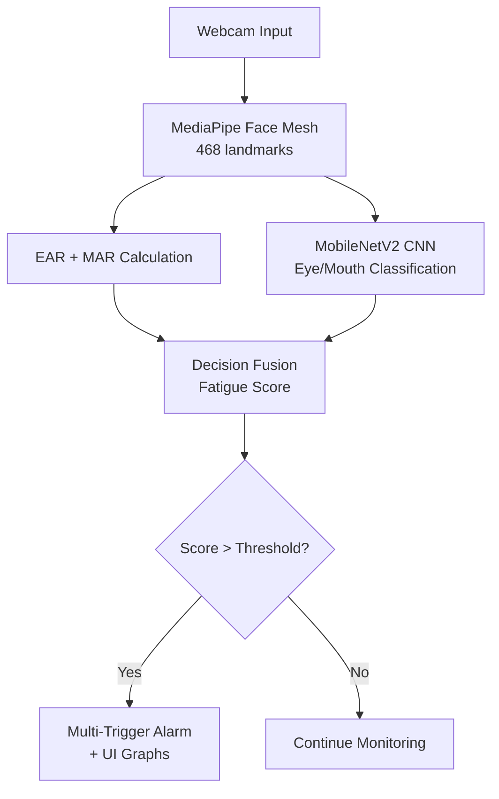

# 🚗 Driver Drowsiness Detection System

[](https://python.org)
[](https://tensorflow.org)
[](https://opencv.org)
[](https://mediapipe.dev)
[](LICENSE)

> Real-time driver drowsiness detection using CNN (MobileNetV2) and Computer Vision.  
> **96.5% accuracy** | **4-class classification** | **Real-time alarm system**

## 📸 Demo

  
  


*(Upload your 3 screenshots to the `screenshots/` folder — I already showed you how. If you haven’t done it yet, just tell me and I’ll repeat the 3 steps.)*

## 🎯 Why This Project Matters

Drowsy driving is a major cause of road accidents worldwide.  
This system detects early signs of fatigue and alerts the driver in real-time — a lightweight, low-cost, deployable safety solution.

## 🔥 Key Features

- **Real-time Detection**: Webcam-based monitoring with MediaPipe Face Mesh (468 landmarks)  
- **Dual Analysis**: Eye Aspect Ratio (EAR) + Mouth Aspect Ratio (MAR) + CNN classification  
- **AI-Powered**: MobileNetV2 CNN with **96.5%** test accuracy  
- **Smart Augmentation**: Stable Diffusion for synthetic training data  
- **Professional UI**: Live fatigue score (0–100%), real-time graphs, status indicators  
- **Multi-trigger Alarm**: Sound alerts for eye closure, yawning, head nodding

## 📊 Performance Metrics

| Class       | Accuracy | Notes                     |
|-------------|----------|---------------------------|
| Closed_Eyes | ~99%     | Almost perfect detection  |
| Open_Eyes   | ~99%     | Clear pattern recognition |
| No_Yawn     | ~95%     | Good distinction          |
| Yawn        | 95.8%    | High recall for safety    |

**Overall Test Accuracy: 96.50%** on 572 test images

## 📚 Dataset

- **Total images**: 2,845  
- **Split**: 80% training + 20% testing (572 test images)  
- **4 Classes**: Closed_Eyes, Open_Eyes, No_Yawn, Yawn (balanced)

**Sources**:
- Public Kaggle datasets  
- Self-collected photos/videos from online sources  
- Augmented with OpenCV + Stable Diffusion (synthetic images)

Full dataset is large, so not on GitHub. Sample images are in `data/sample/`.  
See details → [data/README.md](data/README.md)

## 🏗️ System Architecture




# 🚗 Driver Drowsiness Detection System

[](https://python.org)
[](https://tensorflow.org)
[](https://opencv.org)
[](https://mediapipe.dev)

> Real-time driver drowsiness detection using CNN (MobileNetV2) and Computer Vision.  
> **96.5% accuracy** | **4-class classification** | **Real-time alarm system**

## 📸 Demo 

  
  


## 🎯 Why This Project Matters

Drowsy driving causes thousands of road accidents every year.  
This system detects early fatigue signs and alerts the driver in real-time — a low-cost, lightweight safety solution that can save lives.

## 🔥 Key Features

- **Real-time Detection**: Webcam monitoring with MediaPipe Face Mesh (468 landmarks)
- **Hybrid Intelligence**: Eye Aspect Ratio (EAR) + Mouth Aspect Ratio (MAR) + MobileNetV2 CNN
- **AI-Powered**: 96.5% test accuracy on 4 classes (Closed_Eyes, Open_Eyes, No_Yawn, Yawn)
- **Smart Augmentation**: Stable Diffusion for synthetic data
- **Professional UI**: Live fatigue score (0–100%), real-time graphs, status indicators
- **Multi-trigger Alarm**: Eye closure, yawning, head nodding + sound alerts

## 📊 Performance Metrics

| Class       | Accuracy | Notes                     |
|-------------|----------|---------------------------|
| Closed_Eyes | ~99%     | Almost perfect detection  |
| Open_Eyes   | ~99%     | Clear pattern recognition |
| No_Yawn     | ~95%     | Good distinction          |
| Yawn        | 95.8%    | High recall for safety    |

**Overall Test Accuracy: 96.50%** on 572 test images

## 📚 Dataset

- **Total images**: 2,845  
- **Split**: 80% training + 20% testing (572 test images)  
- **4 Classes**: Closed_Eyes, Open_Eyes, No_Yawn, Yawn (balanced)

**Sources**:
- Public Kaggle datasets  
- Self-collected photos/videos from online sources  
- Augmented with OpenCV + Stable Diffusion (synthetic images)

Full dataset is large, so not on GitHub. Sample images are in `data/sample/`.  
See details → [data/README.md](data/README.md)

## 💻 Installation & How to Run

### 1. Clone the repo
```
git clone https://github.com/raneesur75-ship-it/driver-drowsiness-detection-using-deep-learning.git
cd driver-drowsiness-detection-using-deep-learning
```
### 2. Install packages
```
pip install -r requirements.txt
```
### 3. Run the real-time demo
```
python src/realtime_detector.py
```
### Note:
Your webcam 🎥 will open instantly with live detection, fatigue score, graphs, and alarm sound!


## 🏗️ System Architecture

```
Webcam → Face Mesh → EAR/MAR → CNN → Fatigue Score → Alarm
```
The system uses a hybrid approach (fast rule-based + deep learning) for reliable real-time drowsiness detection.

### 💡 Why This Works

Lightweight → runs on laptop

Hybrid approach → reduces false alarms

Real-time processing → practical deployment

## 🚀 Key Innovations

✅ Hybrid CNN + EAR + MAR system

✅ AI-based data augmentation using Stable Diffusion

✅ Real-time fatigue scoring (not just classification)

✅ Multi-condition alarm logic

## 🔮 Future Improvements

✅Night vision (infrared camera)

✅Mobile app (Android/iOS)

✅Cloud-based monitoring system

✅Voice-based alerts.


